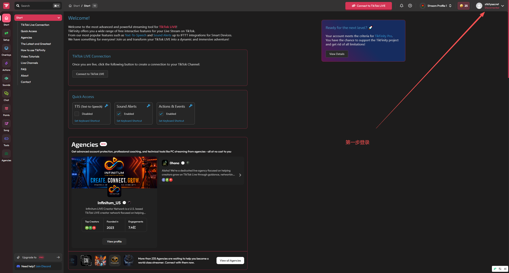
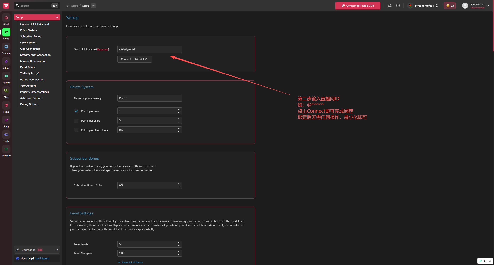

# TikFinity 下载、连接与梅花中控使用攻略

TikFinity负责把TikTok直播间的评论、点赞、礼物等真实事件发送给梅花中控。OBS只负责画面；不要把TikFinity的小组件地址当成梅花OBS舞台地址。

## 1. 下载与安装

1. 打开TikFinity官方桌面版页面：<https://tikfinity.zerody.one/app/>。
2. 下载 `TikFinity_installer.exe`。
3. 运行安装程序。Windows SmartScreen拦截时，确认下载地址确实是上述官方域名，再选择“更多信息 → 仍要运行”。
4. 如果梅花一体包根目录已经存在 `tikfinity/TikFinity.exe`，可以直接使用整包版本，不需要重复下载。

TikFinity是第三方闭源软件，账号、联网服务和更新由TikFinity负责；梅花整包只负责自动拉起和接收本地事件。

## 2. 第一次登录

1. 启动TikFinity。
2. 点击右上角账号区域，注册或登录TikFinity账号。
3. 登录成功后仍显示 `Disconnected` 是正常的，它表示尚未连接正在直播的TikTok房间。



## 3. 绑定TikTok直播间

1. 先让TikTok账号进入真实直播状态。
2. 在TikFinity左侧打开 `Setup → Connect TikTok Account`。
3. 在 `Your TikTok Name` 填写直播账号，例如 `@yourname`。必须使用准确的TikTok用户名，不要填写显示昵称。
4. 点击 `Connect to TikTok LIVE`。
5. 回到 `Start` 页面，确认顶部状态不再是 `Disconnected`。
6. 连接成功后可以最小化TikFinity，但不能退出。



## 4. 与梅花中控连接

梅花中控默认配置已经是：

```text
输入类型：TikFinity
WebSocket：ws://127.0.0.1:21213/
```

通常不需要改TikFinity的积分、等级、声音提示或Overlay设置。只需保持TikFinity运行并连接直播间。

操作顺序：

1. 启动TikFinity并连接正在直播的TikTok账号。
2. 启动梅花系统。
3. 在总控台查看“接入健康 → TikFinity”。
4. 用另一个TikTok账号发送一条真实评论。
5. 再测试一次点赞和一个低价礼物。
6. 中控收到合法真实事件后，TikFinity状态才会从“等待验证”变成“已验证”。仅显示WebSocket已连接不等于实播验证完成。

## 5. 正式开播顺序

1. 打开TikTok直播并确认直播间可进入。
2. 打开TikFinity，连接对应 `@用户名`。
3. 双击一体包的 `2-启动系统.bat`。
4. 检查总控台的TikFinity、内容生成、声音和数字人状态。
5. 打开OBS，确认浏览器源为 `http://127.0.0.1:5173/obs/source/meihua-stage`，尺寸为1080×1920。
6. 用真实小号完成评论、点赞、礼物各一次，再开始正式测算。

## 6. 常见问题

### 显示 `Server not available` 或网页组件加载失败

- 退出TikFinity后重新启动。
- 从官方页面下载最新版覆盖安装。
- 检查Windows防火墙、代理和网络是否拦截 `tikfinity.zerody.one` 或 `tikfinity-origin.zerody.one`。
- 不要随意修改hosts；只有TikFinity官方支持明确要求时才使用其切换服务器功能。

### TikFinity已连接，中控仍显示等待验证

- 必须先真正开播，然后从其他账号发送真实事件。
- 检查中控地址是否为 `ws://127.0.0.1:21213/`。
- 检查是否同时打开了多个TikFinity或多个梅花中控实例。
- 评论、点赞、礼物至少各测试一次；本地模拟数据不能代替实播验证。

### 能看到评论但礼物没有触发

- 确认礼物ID已经存在于梅花礼物目录。
- 连击礼物要等TikFinity发送连击结束事件后结算，不能按每一帧重复计算。
- 在“资格与队列”确认对应礼物规则已启用。

## 官方入口

- TikFinity桌面版：<https://tikfinity.zerody.one/app/>
- TikFinity帮助中心：<https://help.tikfinity.com/>
- TikTok LIVE Studio官方入口：<https://www.tiktok.com/studio/download>
